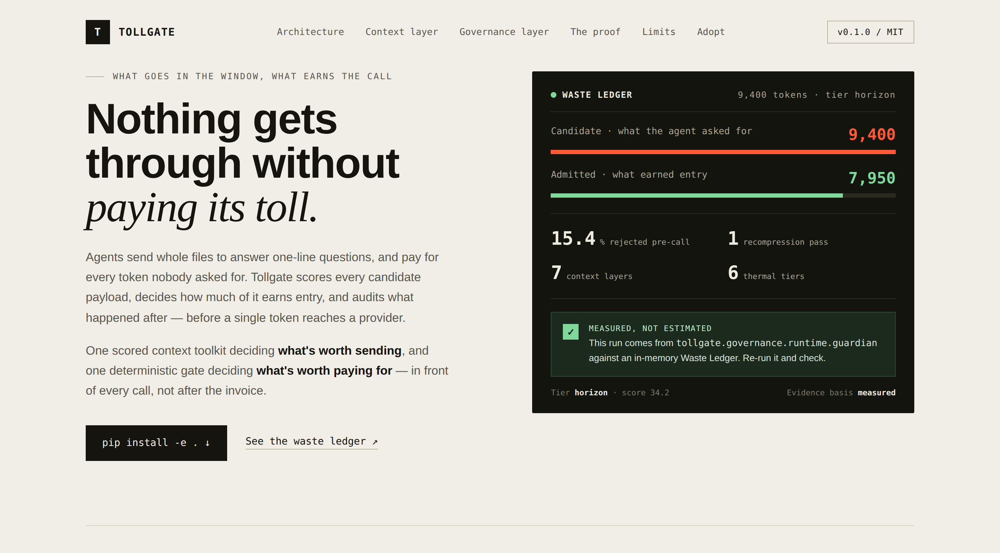

# Tollgate



> Every candidate token must pass three gates: **Admission** — does it deserve
> to enter? **Compression** — can it be smaller? **Audit** — did it generate
> accepted value?

Agents burn tokens on context nobody asked for — whole files instead of the
one function that matters, unscored payloads sent straight to a frontier
model, no record of what was actually worth paying for. Tollgate is a
deterministic gate that sits in front of every provider call: it scores what
an agent wants to send, decides how much of it earns entry, and keeps an
auditable ledger of what was admitted, rejected and why.

Not zero token usage. **Zero unjustified or unaccounted token consumption.**

```bash
pip install -e .
```

## Two layers, one gate

```text
┌──────────────────────────────────────────────────────────────┐
│  tollgate.context      "what goes in the window?"            │
│  tokens · headroom · astx · chunking · semantic · pack · store│
├──────────────────────────────────────────────────────────────┤
│  tollgate.governance    "what earns the call?"                │
│  Guardian · Waste Ledger · thermal-tier dispatch · budgets    │
└──────────────────────────────────────────────────────────────┘
```

### `tollgate.context` — the seven layers

Zero runtime dependencies. Measured on real repositories, reading a
**skeleton instead of a whole file** costs ~87% fewer tokens.

| Layer | Module | What it answers |
|---|---|---|
| Tokens | `tollgate.context.tokens` | What does this cost? |
| Headroom | `tollgate.context.headroom` | What can I still afford? |
| Structure | `tollgate.context.astx` | What is worth quoting? |
| Chunking | `tollgate.context.chunking` | How do I cut it without breaking it? |
| Semantic | `tollgate.context.semantic` | What is relevant? |
| Pack | `tollgate.context.pack` | What actually gets sent — and can I cite it? |
| Persistence | `tollgate.context.store` | What can I avoid recomputing, and what did it actually save? |

```python
from tollgate.context import Headroom, index_path, pack_query

headroom = Headroom(window=200_000, reserve_output=8_000)
headroom.spend("conversation", 120_000)

index = index_path("./src")
context = pack_query("where is the retry backoff configured?", index,
                      budget=6_000, headroom=headroom)
print(context.text)
```

CLI: `tollgate count|skeleton|symbol|outline|search|pack|headroom ...`
(every subcommand takes `--json`).

### `tollgate.governance` — the four planes

A deterministic runtime contract enforced before any provider call:

```text
PLANE 4 — Governance & Observability   Budget · Waste Ledger · Decision Log · Change History
PLANE 3 — Decision                     Complexity score · thermal tier · model routing
PLANE 2 — Context                      Admission backed directly by tollgate.context
PLANE 1 — Deterministic floor          Everything that does not require an LLM executes here
```

Runtime contract:

1. Deterministic before probabilistic.
2. No score, no call.
3. Minimum sufficient context.
4. Hard caps before provider calls.
5. No unlimited retries or automatic frontier escalation.
6. Quality and cost are evaluated together.
7. Measured, estimated and counterfactual evidence never mix.
8. Every admitted token has an auditable purpose and outcome.

Thermal Gradient × RTK tiers (`config/tollgate-dispatch.yaml`):

| Tier | Score | Execution policy |
|---|---:|---|
| Solar | 0–15 | Deterministic, zero-token execution |
| Daylight | 16–30 | Small model, tightly constrained context |
| Horizon | 31–45 | Small or medium model |
| Twilight | 46–60 | Reasoning-capable model |
| Starlight | 61–80 | Advanced reasoning with approval controls |
| Aurora | 81–100 | Frontier model, maximum budget, mandatory approval |

Pre-call hook contract (`hooks/pre_call_guardian.py`, stdin/stdout JSON,
exit `0` admitted / `2` blocked):

```bash
export TOLLGATE_DB=~/.tollgate/telemetry.db
cat request.json | python3 hooks/pre_call_guardian.py
```

## Repository layout

```text
tollgate/
├── src/tollgate/
│   ├── context/        # tokens, headroom, astx, chunking, semantic, pack, store
│   └── governance/
│       ├── runtime/     # Guardian, provider gateway, provider adapters
│       └── store/       # waste ledger, decision log, change history, budget reservations
├── hooks/               # pre-call interceptor (stdin/stdout contract)
├── config/              # thermal-tier dispatch policy
├── schemas/             # JSON Schemas for the ledger, decision log, change history
├── scripts/             # cost_report, rightsizing, gate, complexity scoring, sync_registry
├── dashboard/           # self-contained HTML dashboard generator
├── docs/                # architecture, extension and operationalization notes
├── benchmarks/          # context-layer benchmark harness
└── tests/
    ├── context/
    └── governance/
```

## Quick start

```bash
python3 -m pytest tests/
python3 scripts/complexity_score.py --ast-nodes 320 --dependency-depth 8 \
  --transform-density 0.72 --branch-density 0.25 \
  --external-systems 3 --unsupported-constructs 1
python3 dashboard/generate_dashboard.py
```

## Integrate Tollgate into your project

There are two supported ways in, and they compose: use the context layer
alone, the gate alone, or both together.

### 1. As a Python library — `tollgate.context`

For a Python project that just wants better context, without the
governance layer:

```bash
pip install -e /path/to/tollgate   # or: pip install tollgate, once published
```

```python
from tollgate.context import Headroom, index_path, pack_query

headroom = Headroom(window=200_000, reserve_output=8_000)
headroom.spend("conversation", 120_000)

index = index_path("./src")
context = pack_query("where is the retry backoff configured?",
                      index, budget=6_000, headroom=headroom)
your_llm_call(system_prompt, context.text)
```

No dependency on the governance layer, no database, no config file.

### 2. As a language-agnostic pre-call gate — the hook contract

For anything that isn't Python, or that wants the full admission →
compression → audit contract in front of every provider call, shell out to
`hooks/pre_call_guardian.py`. It reads one JSON object from stdin and
writes an allow/block decision to stdout — exit `0` admitted, `2` blocked:

```bash
export TOLLGATE_DB=~/.tollgate/telemetry.db
echo '{
  "session_id": "session-001",
  "project_id": "my-agent",
  "artifact_id": "turn-042",
  "payload": "...the candidate context your agent wants to send...",
  "complexity_score": 34.2,
  "tier": "horizon",
  "provider": "anthropic",
  "model": "claude-sonnet-5",
  "estimated_cost_usd": 0.42
}' | python3 hooks/pre_call_guardian.py
```

A blocked call returns `{"allow": false, "reason": "..."}` and exit code
`2` — treat that as "do not call the provider," not as an error to retry
past. An admitted call returns the (possibly compressed) `payload` your
agent should actually send, plus `admitted_tokens` / `rejected_tokens` for
your own logging.

Wiring this into your own agent loop means calling the hook (as a
subprocess, or by importing `Guardian` directly if you're in Python — see
`hooks/pre_call_guardian.py` for the ~15-line reference implementation)
immediately before every provider call, and respecting its verdict.

### 3. As a Claude Code plugin

This repository is a valid Claude Code plugin (`.claude-plugin/plugin.json`):

```bash
claude --plugin-dir /path/to/tollgate
```

`hooks/hooks.json` registers `hooks/claude_code_pretooluse.py` on the
`Task` matcher — the one `PreToolUse` payload that actually resembles
context handed to another LLM turn (Claude Code doesn't expose a hook on
its own model calls, so a subagent's prompt is the closest interception
point available). It reads the real `PreToolUse` schema Claude Code sends
(`tool_name`, `tool_input`, `session_id`, `cwd`, `tool_use_id` — not the
custom envelope above), gates the subagent's `prompt` field through the
same Guardian, and — when it compresses something — rewrites the prompt in
place via the hook's `updatedInput` field, so the subagent actually runs on
the smaller payload instead of the original:

```json
{
  "hookSpecificOutput": {
    "hookEventName": "PreToolUse",
    "permissionDecision": "allow",
    "permissionDecisionReason": "Tollgate: admitted (tier=large, score=100.0)",
    "updatedInput": { "description": "...", "prompt": "[tollgate] truncated to fit ..." }
  }
}
```

This bridge deliberately does **not** reuse `config/tollgate-dispatch.yaml`'s
Solar-to-Aurora tiers or `scripts/complexity_score.py` — those model how
much LLM reasoning an artifact deserves, and a small Task prompt does not
mean "give this zero tokens" the way a trivial migration lookup does. It
uses its own three payload-size buckets instead (see the module docstring
in `hooks/claude_code_pretooluse.py`). Extend the `Task` matcher to other
tools (e.g. `mcp__.*`) if their payloads deserve the same gate — and if you
want tier-based *model routing*, not just size-based compression, that
still needs your own `complexity_score` per project (see below).

`complexity_score` and `tier` in the `pre_call_guardian.py` contract above
are not computed for you — see
[`docs/EXTENDING.md`](docs/EXTENDING.md) for how to write the scoring
function for your own artifact types.

## Status

Plane 2 (Context) is wired directly to `tollgate.context`'s pack/headroom
primitives — an oversized candidate payload is compressed by packing it
through a query-aware budget instead of a naive truncation. See
[`docs/EXTENDING.md`](docs/EXTENDING.md) for what's still domain-specific
versus reusable as-is.

Target metrics below are acceptance criteria from an original pilot,
**not current production claims** — recalibrate against your own Phase 0
baseline.

| Metric | Target |
|---|---:|
| Deterministic operations | 25–35% |
| Context reduction for LLM cases | ≥80% pilot |
| Blended reduction | 85–90% |
| Structural pass rate | ≥95% |
| Cost per completed artifact | < US$50 |
| Unaccounted token consumption | 0% |

## License

MIT — see [LICENSE](LICENSE).
